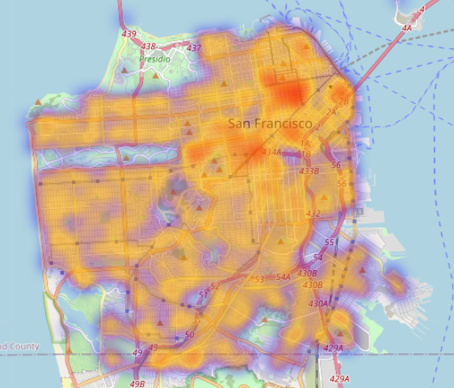
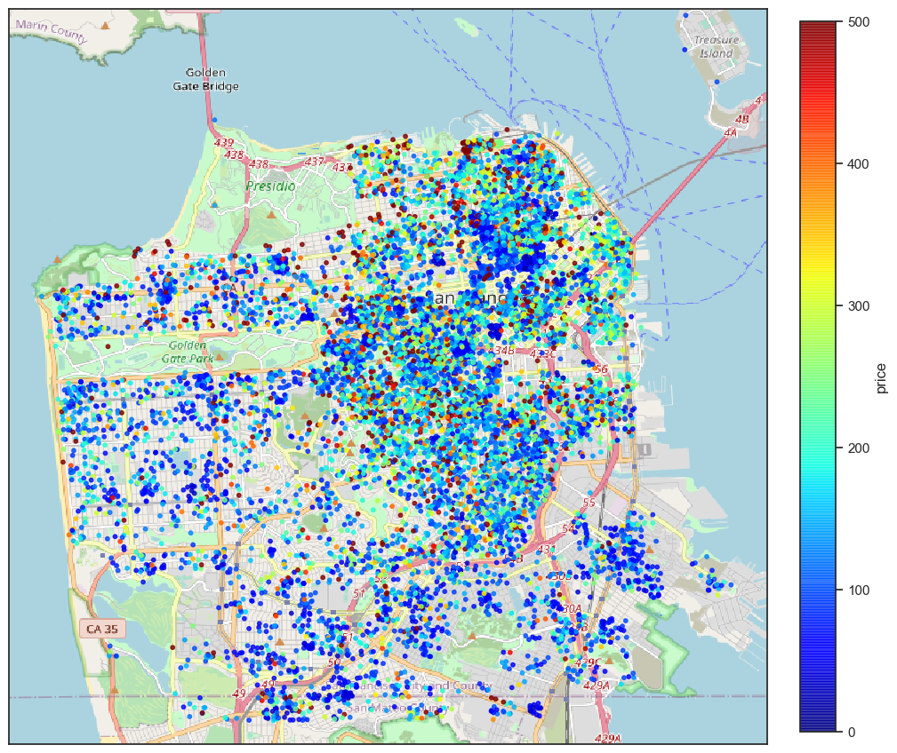
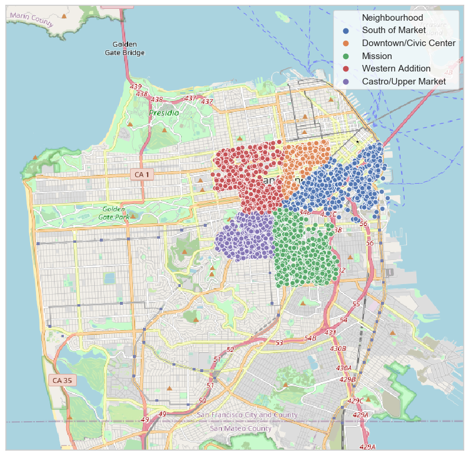
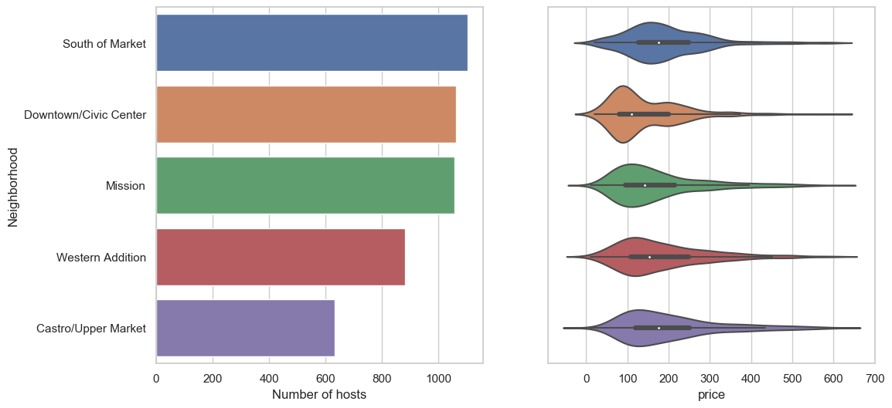
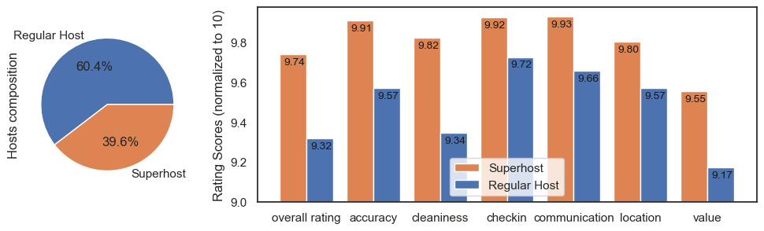
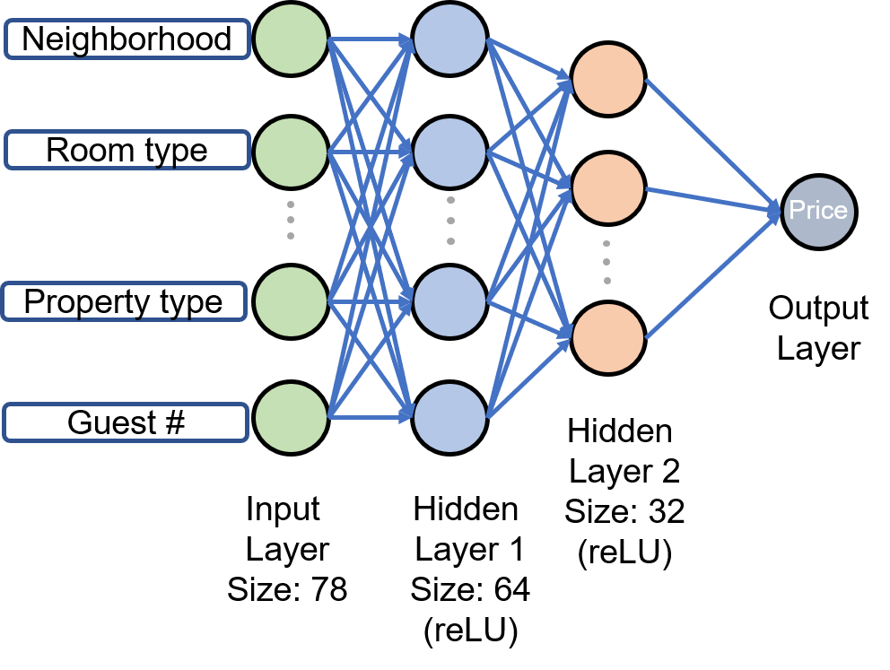

# This is How I Estimate Price for Airbnb in San Francisco using Neural Network

Haoming Jin

## 1. Introduction

### 1.1 Motivation
Airbnb is an online marketplace for arranging or offering lodging, primarily homestays, or tourism experiences. Airbnb is founded in 2008 and based in San Francisco, California. San Francisco is also the place where I am most interested in developing my own data analyst/scientist career. Also, analysis of these housing data is very valuable for business decisions.

### 1.2 Data

The Data used in this project is obtained from the website _Inside Airbnb_ , http://insideairbnb.com/. This is a website that collects data from publicly available information on Airbnb, it contains very detailed information craped from Airbnb listings all over the world, updated monthly. The data we used is all the listings in San Francisco, from 2019/04 to 2020/04. The data contains in total 12074 rows and 82 columns with relevant data about listings, including location, neighbourhood, prices and fees, review scores, host information, detailed listing description and images etc. 

## 2. Exploratory Data Analysis

### 2.1 Intuitive Map Images

The interactive map shows a heatmap of densities of Airbnb locations in San Francisco, we can see that the density is much higher in the north-east coastal areas.

If we plot the prices as colored dots on the map, we can see that the higher priced listings are mostly in the central areas and houses very close to the coast.

### 2.2 Neighbourhoods

We want to know if the neighborhoods have some affect on pricing. There are in total 36 different neighborhoods in the original data, the following plots show the neighborhoods with the top 5 most number of listings, their total listing numbers and the price distribution.

Indeed most of the listings are in the central and north-east coastal areas. Also, Downtown/Civic Center area have the lowest average price, but there is a clear seperation of a group of higher prices around 200, and another group of lower prices around 90.

### 2.3 Superhosts

Superhosts are experienced hosts who meet a certain set of requirements and are supposedly better and more qualified than regular hosts. In San Francisco 39.6% of the hosts are qualified as superhosts. The ratings are described as follow:
1. Overall: The overall experience.
2. Accuracy: How accurately did the listing page represent the space?
3. Cleanliness: Did guests feel that the space was clean and tidy?
4. Check-in: How smoothly did check-in go?
5. Communication: How well did you communicate before and during the stay? Guests often care that their host responds quickly, reliably, and frequently to their messages and questions.
6. Location: How did guests feel about the neighborhood? This may mean that there's an accurate description for proximity and access to transportation, shopping centers, city center, etc., and a description that includes special considerations, like noise, and family safety.
7. Value: Did the guest feel that the listing provided good value for the price?

In average, superhosts have a 0.2 - 0.4 higher ratings in all aspects compared to regular hosts.

## 3 Machine Learning Price Prediction

In this section, we applied multiple machine learning methods to predict the price of a listing by the following information it provided:
1. Neighbourhood
2. Property type
3. Room type
4. Number of accommodated guests
5. Number of bathrooms
6. Number of bedrooms
7. Number of beds
8. Bed type

The rows with missing values are dropped, the categorical data: neighbourhood, property type, room type and bed type are converted into one hot encodings.

After these preprocessing, X is a 11307 row, 78 column matrix, y is a 11307 row, one column vector of prices.

X,y are divided into 70% training data and 30% testing data.

### 3.1 Linear Regression
The following models are used:

**1. Linear Regression (Ordinary Least Squares)**
fits a linear model with coefficients $\vec w$
 to minimize the residual sum of squares between the observed targets in the dataset

$\min_{w} || X w - y||_2^2$

**2. Ridge Regression**
Addresses some of the problems of Ordinary Least Squares by imposing a penalty on the size of the coefficients. The ridge coefficients minimize a penalized residual sum of squares:

$\min_{w} || X w - y||_2^2 + \alpha ||w||_2^2$

**3. Lasso Regression**
Similar to Ridge Regression, imposes a penalized term on the l1-norm of the coefficient vecter $\vec w$

$\min_{w} { \frac{1}{2n_{\text{samples}}} ||X w - y||_2 ^ 2 + \alpha ||w||_1}$

### 3.2 Tree Based Regressions

The idea is that tree based regressions may be better at fitting the data that is highly complex and non-linear. They can also handle missing data and outliers pretty well. We tried __Decision Tree, Random Forest and XGBoost__ models.

### 3.3 Neural Network

Neural network is the machine learning algorithm that mimics the working of neron in human brian for learning. Although more oftenly used for classification problems, they are also very useful for regression problems such as predicting prices. The following is the archetechture I have used:

For this kind of regression problem, you only need one or two hidden layers at most.

### 3.4 Model Evaluation:
In this part, we use 3 metric to evaluate the predictions:
1. Mean absolute error (MAE): The average of absolute difference between predicted and actual price
2. Root Mean Square Error (RMSE): The square root of the average squared difference
3. R2 score: The percentage of the response variable variation that is explained by a linear model

**Linear Regression:**

MAE =  51.773

RMSE =  71.587

R2 score =  0.513

**Ridge Regression:**

MAE =  51.766

RMSE =  71.585

R2 score =  0.513

**Lasso Regression:**

MAE =  51.999

RMSE =  72.110

R2 score =  0.506

**Decision Tree Regression:**

MAE =  56.991

RMSE =  87.364

R2 score =  0.243

**Random Forest Regression:**

MAE =  52.326

RMSE =  78.242

R2 score =  0.393

**XGBoost Regression

MAE =  55.427

RMSE =  83.762

R2 score =  0.304

**Neural Network (Best)

MAE =  46.152

RMSE =  66.048

R2 score =  0.550

The performance of these models are very similar, with Neural Network Regression performing a little better than the rest of the methods.

The following are 10 random samples from the test data and the predicted price.

|price	|predicted price|
|-------|---------------|
|300.0	|201.59|
|139.0	|160.51|
|200.0	|127.76|
|175.0	|190.97|
|50.0	|89.59|
|107.0	|143.07|
|94.0	|87.22|
|265.0	|109.85|
|199.0	|192.00|
|349.0	|222.84|

## Conclusion

Our findings are:

1. Most airbnb rentals in San Francisco are in the north-east coastal areas.
2. Prices in most neighbors are skewed to the right. The Downtown/Civic area while having the lowest average price, shows a bimodal distribution. This suggests a gap between the rich and poor.
3. Superhosts in general provide better renting experience, their rating in all aspects were 0.2 - 0.4 higher in rating than regular hosts.
4. We have used multiple machine learning algorithms to successfully make an estimation for airbnb rent price. In which Neural Network Regression has the best performance with a 55% R2 score.

The complete analysis can be found in my github repo:
[https://github.com/carterjin/Capstion-Project-San-Francisco-Airbnb-Data-Analysis-and-Machine-Learning-Price-Prediction](https://github.com/carterjin/Capstion-Project-San-Francisco-Airbnb-Data-Analysis-and-Machine-Learning-Price-Prediction)